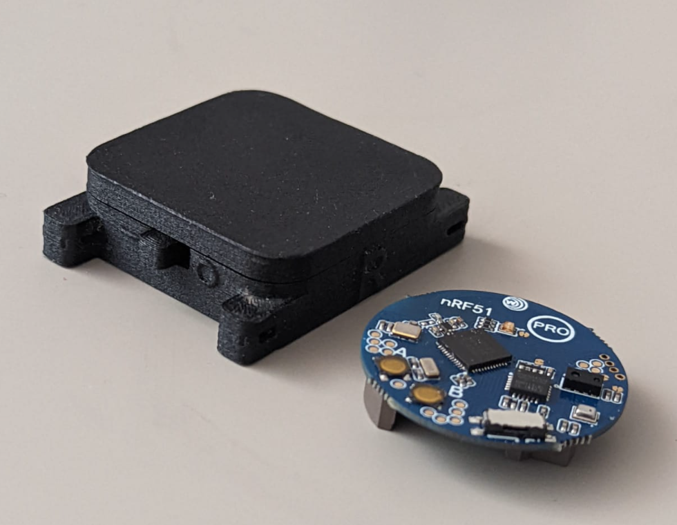
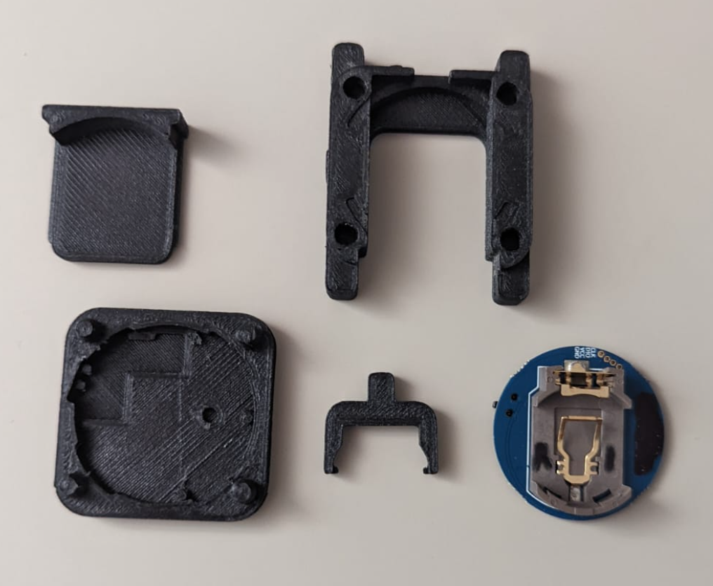
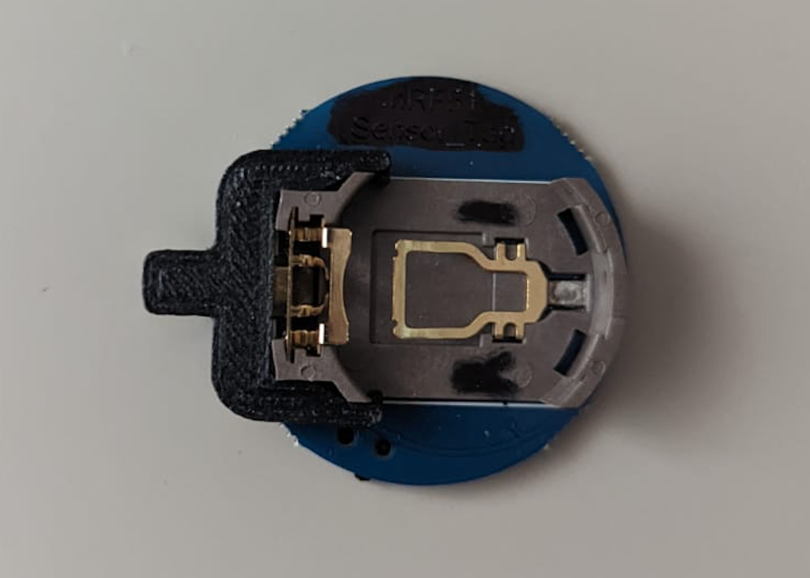
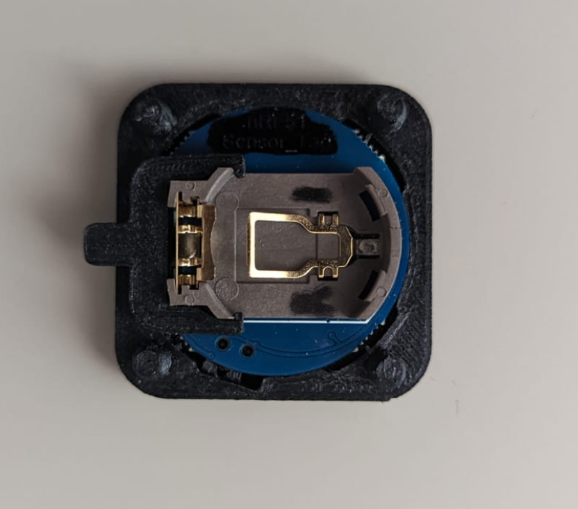
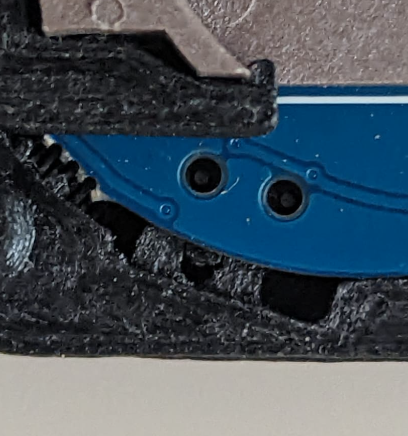
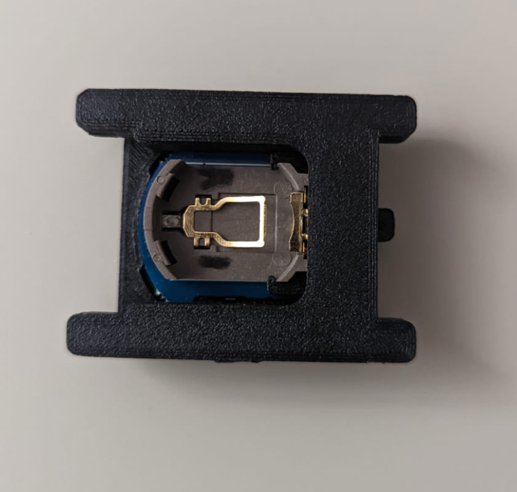
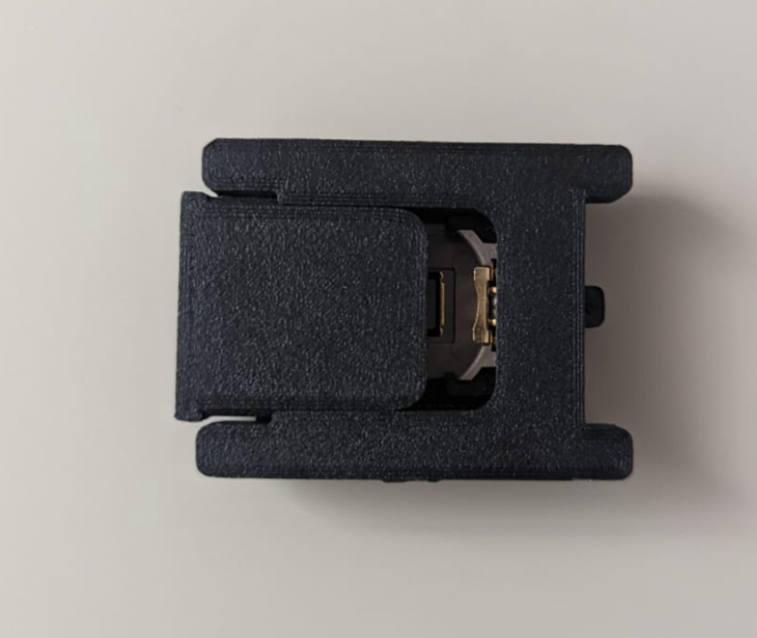

# A fully 3d printable housing for the nrf51 sensor tag platform 

Fully 3d-printed, no additional parts. Incorporates the built-in switch on the nrf51 sensor tag. I recommend printing with CF nylon for non-destructive disassembly. Housing wings for zip-tie fixturing. 

### Assembly guide

1. Verify parts 

2. Install switch arm 

3. Insert board into the bottom housing. Make sure the built in switch falls into the housing pins

4. Press-fit the top housing 

5. Insert the cover

